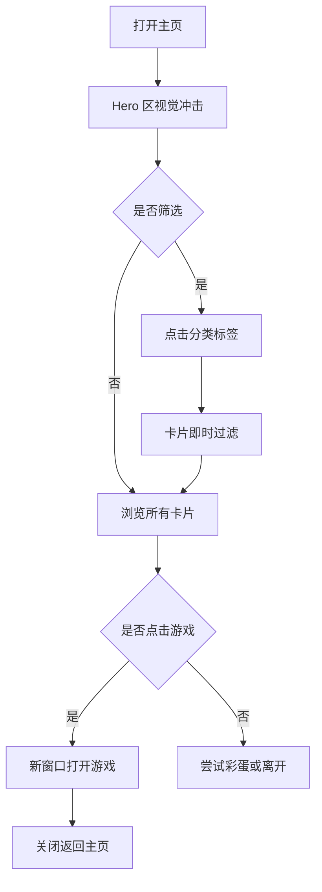

## 1. 产品概述
打造一个视觉冲击力极强的"复古未来主义霓虹街机"风格游戏门户主页，让用户打开页面的瞬间被色彩、动效与排版深深吸引，忍不住点击体验。
- 主要用途：作为 21 款 HTML 游戏的统一入口门面
- 目标用户：怀旧街机玩家、解压休闲玩家、寻找轻量网页游戏的人
- 价值主张："踏入霓虹维度，开启像素狂欢"——用极致视觉反差建立记忆点

## 2. 核心功能

### 2.1 用户角色
本产品为内容展示型站点，无登录/注册系统。

### 2.2 功能模块
1. **首屏 Hero 区**：巨型故障风标题、动态网格背景、滚动 CTA 提示
2. **游戏卡片陈列区**：21 款游戏以可交互卡片网格展示，按类别筛选
3. **分类筛选条**：策略 / 益智 / 棋盘 / 动作 四大类即时过滤
4. **悬停特效系统**：鼠标悬停触发光晕、倾斜、粒子扩散
5. **彩蛋控制台**：键盘输入特定字符触发彩蛋动画
6. **页脚霓虹带**：版权信息 + 跳动的频谱条

### 2.3 页面详情
| 页面名称 | 模块名称 | 功能描述 |
|---------|---------|---------|
| 主页 | Hero 故障标题 | 巨型"NEON ARENA"标题，分层错位、扫描线、随机跳帧 |
| 主页 | 透视网格背景 | CSS 3D 透视 + 滚动偏移营造 80s 街机地面 |
| 主页 | 分类筛选条 | 4 个分类胶囊按钮，激活态有发光描边 |
| 主页 | 游戏卡片 | 21 张卡片，每张含 emoji 图标、中英名、分类标签、点击新窗口打开 |
| 主页 | 鼠标光晕 | 自定义光标 + 移动光晕跟踪 |
| 主页 | 彩蛋控制台 | 输入"NEON"触发全屏闪烁 |
| 主页 | 页脚 | 滚动文字 + 频谱条 |

## 3. 核心流程
用户进入主页 → 看到 Hero 故障标题与滚动网格 → 鼠标移动体验光晕 → 浏览/筛选游戏卡片 → 悬停查看游戏简介 → 点击新窗口打开游戏 → 关闭回到主页继续探索

## 4. 用户界面设计

### 4.1 设计风格
- **主色**：深夜紫 `#0b0220`、霓虹粉 `#ff2bd6`、电光青 `#00f0ff`、酸柠黄 `#f5ff3d`
- **次色**：哑光黑 `#08001a`、烟雾灰 `#1a0f3a`
- **按钮**：胶囊形 + 1px 霓虹描边 + 发光阴影
- **字体**：标题用 `Audiowide` 或 `Press Start 2P`（像素感）、正文用 `Space Mono`（等宽终端感）
- **布局**：Hero 居中满屏，卡片网格 4 列响应式，模块间大量负空间
- **图标**：每个游戏配一个超大 emoji 作为视觉标识

### 4.2 页面设计概览
| 页面名称 | 模块名称 | UI 元素 |
|---------|---------|---------|
| 主页 | Hero | 全屏深紫底，巨字"NEON ARENA"故障分层，底部"VANTA ARCADE 2026"小字 |
| 主页 | 网格地平线 | 透视网格向上滚动，融合到 Hero 底缘 |
| 主页 | 分类条 | 4 个胶囊：ALL · STRATEGY · PUZZLE · BOARD · ACTION |
| 主页 | 卡片 | 圆角玻璃拟态背景 + 渐变描边 + 大 emoji + 中英名 + 霓虹"PLAY →" |
| 主页 | 页脚 | 顶部频谱条 + 中部 "MADE WITH ❤ IN NEON CITY" |

### 4.3 响应式
- 桌面优先（≥1280px 4 列，1024px 3 列）
- 平板（768px 2 列）
- 手机（≤640px 1 列 + Hero 字号缩小）

### 4.4 视觉特效清单
- 故障文字（多层错位 + clip-path + 跳帧）
- 扫描线覆盖层
- 鼠标光晕（CSS 径向渐变跟随）
- 透视网格（CSS 3D transform）
- 卡片悬停倾斜 + 发光描边动画
- 全屏粒子飘动（少量 canvas 粒子）
- 输入彩蛋全屏闪烁
