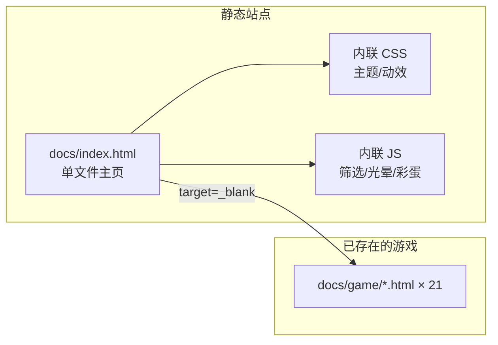

## 1. 架构设计



单文件静态主页，不引入构建工具与外部框架。直接通过相对路径 `game/xxx.html` 链接到 21 款游戏。

## 2. 技术选型
- **前端**：纯 HTML5 + CSS3 + Vanilla JS（无 React/Vue，保持零依赖、零构建）
- **图标**：原生 emoji（无 SVG，无外部图标库，零网络请求）
- **字体**：Google Fonts（`Press Start 2P` 像素 + `Space Mono` 等宽 + `Audiowide` 装饰）
- **构建**：无（直接打开 `index.html` 即可运行）
- **部署**：静态托管（GitHub Pages 等），与 `docs/` 目录天然兼容

## 3. 路由/页面
| 路径 | 用途 |
|------|------|
| `/` 或 `docs/index.html` | 主页（Hero + 分类 + 卡片 + 页脚） |
| `game/<name>.html` | 21 款游戏，新窗口打开 |

## 4. 数据源
游戏元数据以 JS 对象数组形式内联在 `index.html` 中：
```js
const GAMES = [
  { id: 'tictactoe', title: '井字棋', en: 'Tic Tac Toe', cat: 'board', emoji: '⭕' },
  { id: 'chess',     title: '国际象棋', en: 'Chess',       cat: 'strategy', emoji: '♟️' },
  // ... 共 21 条
];
```

## 5. 分类定义
| 分类键 | 中文名 | 颜色 |
|--------|--------|------|
| `all` | 全部 | 青色 `#00f0ff` |
| `strategy` | 策略 | 粉色 `#ff2bd6` |
| `puzzle` | 益智 | 黄色 `#f5ff3d` |
| `board` | 棋盘 | 紫色 `#a06bff` |
| `action` | 动作 | 橙红 `#ff6b3d` |

## 6. 关键动效实现要点
- **故障文字**：两层 `text-shadow` 红蓝错位 + `@keyframes` 步进跳帧
- **透视网格**：CSS `transform: perspective() rotateX(60deg)` + 渐变 `linear-gradient` + `animation` 平移
- **鼠标光晕**：`mousemove` 监听更新 CSS 变量 `--mx` `--my`，由 `radial-gradient` 渲染
- **卡片倾斜**：`mousemove` 监听计算鼠标在卡片内位置，更新 `transform: rotateX() rotateY()`
- **粒子**：单个 `<canvas>` 绘制 40 颗星点，requestAnimationFrame 循环
- **彩蛋**：监听 `keydown` 拼接 buffer，输入 "NEON" 时给 body 加临时 class 触发 `@keyframes flash`

## 7. 性能与兼容
- 全部 CSS/JS 内联，单次请求加载，无外部阻塞
- 使用 `prefers-reduced-motion` 关闭剧烈动画
- Canvas 粒子 < 60 颗，桌面 60fps 无压力
- 兼容现代浏览器（Chrome / Edge / Safari / Firefox 最新两版）
