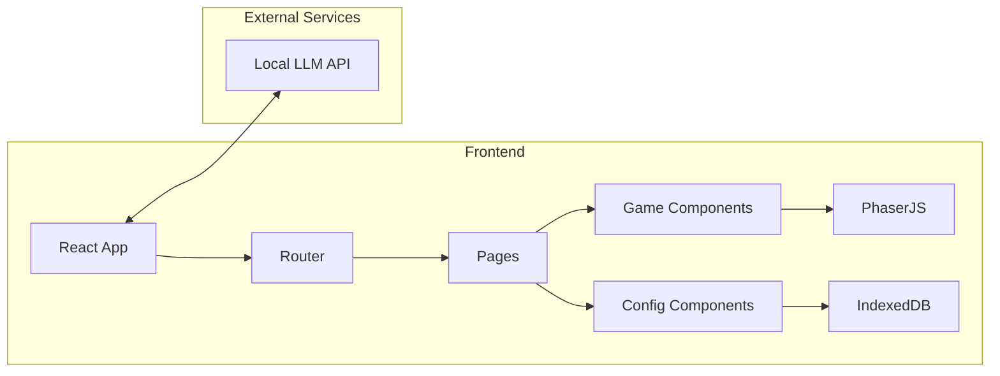
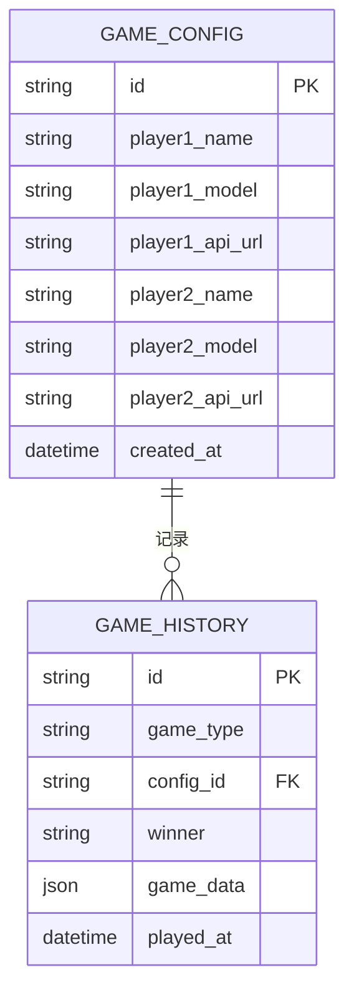

## 1. Architecture Design



## 2. Technology Description
- Frontend: React@18 + TypeScript + tailwindcss@3 + vite
- Initialization Tool: vite-init
- Game Engine: Phaser@3
- Storage: IndexedDB
- State Management: zustand
- Backend: None (纯前端)
- Database: IndexedDB (浏览器本地)

## 3. Route Definitions
| Route | Purpose |
|-------|---------|
| / | 首页 - 项目介绍和游戏列表 |
| /config | 模型配置页面 - 配置双方大模型参数 |
| /game/tank | 1v1坦克对战游戏 |
| /game/snake | 贪吃蛇对战游戏 |
| /game/tetris | 俄罗斯方块对战游戏 |
| /game/sokoban | 推箱子对战游戏 |
| /game/mario | 马里奥对战游戏 |

## 4. Data Model
### 4.1 Data Model Definition



### 4.2 Data Definition (IndexedDB)

```typescript
// Game Config Store
interface GameConfig {
  id: string;
  player1: {
    name: string;
    model: string;
    apiUrl: string;
  };
  player2: {
    name: string;
    model: string;
    apiUrl: string;
  };
  createdAt: Date;
}

// Game History Store
interface GameHistory {
  id: string;
  gameType: string;
  configId: string;
  winner: 'player1' | 'player2' | 'draw';
  gameData: any;
  playedAt: Date;
}
```
